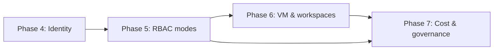

# ResearchCloud Roadmap

ResearchCloud is delivered in phases. Phase 1 establishes the foundation and a runnable
vertical slice; later phases build out the full feature set from the product vision.

## Phase 1 - Foundation + vertical slice (delivered)

- [x] Monorepo scaffold (frontend, backend, deploy, infra) with lint/test/build tooling
- [x] Prism Central connection management (CRUD + test, credentials encrypted at rest)
- [x] `NutanixClient` abstraction with mock + live (v4 REST) providers
- [x] Create & manage Nutanix Projects
- [x] Deploy Nutanix Files
- [x] Deploy Nutanix Objects
- [x] Nutanix-themed UI (purple `#7855fa`, charcoal, rounded typography)
- [x] Single-VM deploy: one bash script provisions a Debian VM (nginx + systemd, git-based)

## Phase 2 - Storage + provisioning depth

- [x] Create file shares (select Files cluster, set permissions)
- [x] Create buckets in object stores
- [ ] Wire Terraform / Calm DSL provisioners for real create paths

## Phase 3 - Self-Service + consoles

- [ ] Self-Service blueprint builder (OS, applications)
- [ ] Dynamic install from a URL -> generated bash / PowerShell scripts
- [ ] Runbooks (repeatable, selectable by other users) generated as Calm DSL
- [ ] VNC console for VMs in a user's project (WebSocket proxy to Prism)

## Phase 4 - Identity + network security

- [ ] User management linked to Active Directory groups & Projects (IAM / LDAP)
- [ ] Flow microsegmentation management UI (`microseg` v4 namespace)

## Phase 5 - Access modes & RBAC (Admin vs End-user)

Introduce two first-class experiences on top of the Phase 4 identity work, so the
platform behaves like a self-service portal (Ronin-style) with IT oversight.

- [ ] Role model: `admin` and `end_user` roles, project membership, and a permission
      layer enforced in the backend (route guards / dependencies) and reflected in the
      frontend (conditional navigation and actions).
- [ ] Map Active Directory groups -> roles and project membership (extends Phase 4).
- [ ] Admin mode (IT console): manage Prism Central connections, users & roles,
      projects, quotas/budgets, the blueprint/runbook library, and all resources across
      connections.
- [ ] End-user mode (self-service portal): scoped to the projects a user belongs to;
      self-service machines/storage, deploy from approved blueprints, and view their
      project's cost & budget. No access to connection credentials or other projects.
- [ ] Audit logging of privileged actions (supports the "IT oversight" model).

Architecture note: roles build on the existing `User` model (`is_admin`, `ad_groups`)
and add a project-membership join table; the frontend gates routes/nav by role.

## Phase 6 - VM & workspace management (Ronin-style self-service)

Replicate the core Ronin "machines" experience: simple, project-scoped VM lifecycle
with cost-saving controls, built on the Nutanix v4 `vmm` namespace.

- [x] VM inventory per project: list VMs with power state, size, project, and IP
      (filterable by project).
- [x] VM lifecycle: create, power on/off/restart, and delete (v4 `vmm`).
- [x] Sizing presets (small / medium / large / GPU) to hide cloud complexity,
      mirroring Ronin's one-click machine creation.
- [ ] Resize (vCPU/RAM) and add/expand disks.
- [ ] Smart scheduling & idle auto-stop: scheduled power on/off and automatic stop of
      idle VMs to control spend (the cost hook is shared with Phase 7).
- [ ] Per-project quotas (vCPU / memory / storage / VM count).
- [ ] Secure connect: VNC console (from Phase 3) plus connection helpers as a
      RONIN LINK analog.

Architecture note: add a `vms` service backed by the `NutanixClient` abstraction
(mock + live), so VM management is demoable without hardware, like Phase 1.

## Phase 7 - Cost management & governance (NCM Cost Governance on-prem)

Integrate Nutanix Cloud Manager (NCM 2.0) Cost Governance, which now runs on-prem
(no SaaS/Beam) and exposes a TCO metering model with showback/chargeback.

- [ ] Cost provider abstraction (`CostClient`) with a mock and a live NCM Cost
      Governance client, mirroring the `NutanixClient` pattern (demoable without NCM).
- [ ] Showback / chargeback: cost per VM/hour and per project, allocated to cost
      centers / business units using the NCM TCO metering model.
- [ ] Project & cost-center budgets with forecasting and threshold alerts (email).
- [ ] Pre-launch cost estimate: show the projected daily/monthly cost in the deploy
      and VM-creation dialogs before the user confirms ("cost before you click Deploy").
- [ ] Budget-driven auto-pause: when a project crosses its threshold, automatically
      stop its VMs (ties Phase 6 scheduling to Phase 7 budgets), matching Ronin's
      project auto-pause.
- [ ] Cost dashboards: spend by project, cost center, and resource, with trends.

Architecture note: Cost Governance is a Nutanix module (on AHV/ESXi) surfaced via NCM;
the live client targets NCM v4 cost endpoints as they become available, with the mock
providing realistic figures in the meantime.

## Phase dependencies

## Notes on Nutanix APIs

- v4 REST APIs are GA and the recommended integration surface; legacy v1-v3 deprecate
  in Q4 2026.
- Full Projects support in v4 is expected mid-2026, so Projects currently use the v3 API
  in the live client.
- Calm DSL / NCM Self-Service DSL is Python-based and actively maintained, which informs
  the choice of a Python backend.
- NCM 2.0 Cost Governance runs natively on-prem (the former Beam SaaS control plane is no
  longer required) and provides a TCO metering model (cost per VM/hour) with
  showback/chargeback - this is the integration target for Phase 7.
- ResearchCloud's product direction parallels Ronin.cloud (self-service research
  computing with budgets and auto-pause), adapted to Nutanix private cloud instead of AWS.
